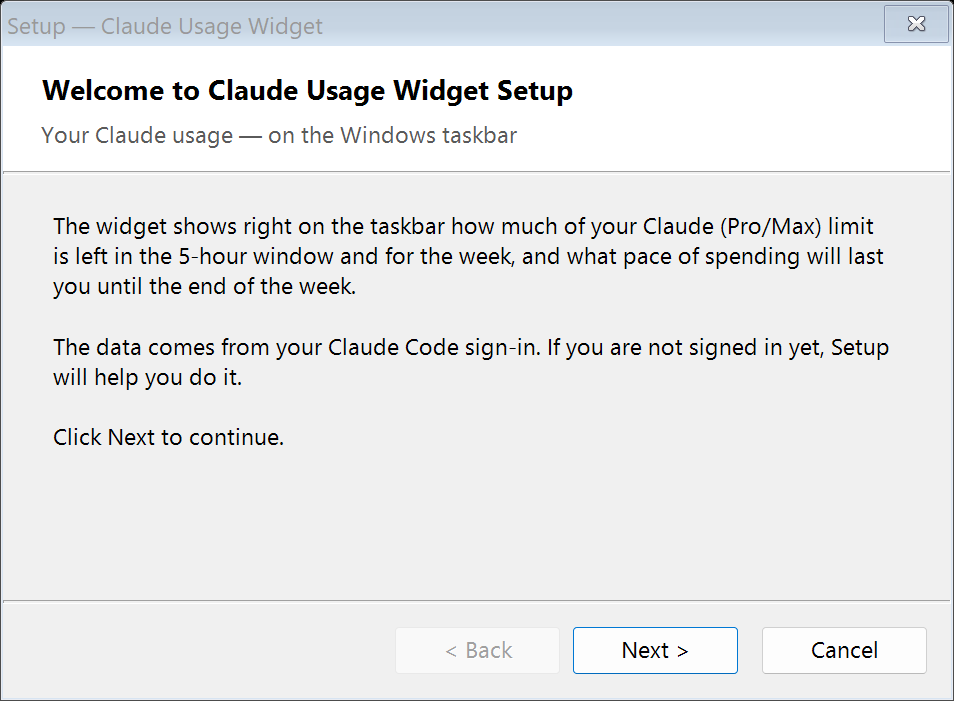
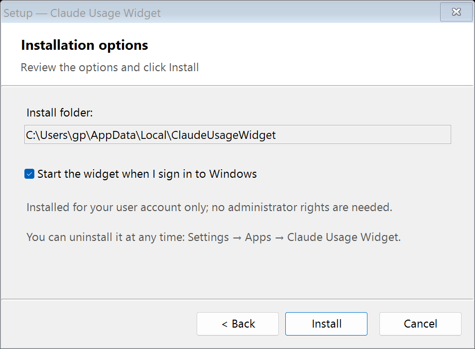

# Claude Usage Widget

[Русский](README.md) | **English**

Your real Claude (Pro / Max) usage — right on the Windows taskbar, with a spend plan.

**The widget itself spends none of your limit:** it only reads usage statistics and never sends a request to a model.

The usage page on claude.ai says "On track" by counting linearly to the reset. This project counts differently:
how much you can spend to land at exactly 100% **by Friday evening** (weekly limit) and **by the end of the
5-hour window** — and shows the result on the taskbar.


The top row is the 5-hour window, the bottom row is the week. The bar shrinks as you spend and changes colour:
green — on plan, yellow and red — spending is ahead of plan. On top of the weekly bar (the overall limit for all
models) a lighter shade shows what is left of the separate weekly Fable limit (if your plan has one); the same
figure is shown in brackets in the row caption.

The widget and the installer are in English or Russian, picked by the Windows display language.

> [!WARNING]
> **Unofficial tool — use at your own risk.** The widget is not affiliated with Anthropic. It reads the Claude Code
> sign-in token on your computer, uses it to call an undocumented usage endpoint, and refreshes the token itself
> when it expires. Anthropic [intends subscription sign-in](https://code.claude.com/docs/en/legal-and-compliance) for Claude Code and its own apps only and
> restricts its use by third-party software. The terms make no exception for reading usage statistics, so
> Anthropic may cut off the widget's access to the data or take action on the account. The token is never sent
> anywhere except Anthropic's servers; all the code is open.

## Quick install (Windows)

1. Download **[ClaudeUsageWidget-Setup.exe](https://github.com/gp131313/claude-usage-widget/releases/latest/download/ClaudeUsageWidget-Setup.exe)**.
2. Run it and click through the wizard: Next → Install → Finish.

<p> </p>

If you are not signed in to Claude Code yet, the installer offers to install Claude Code and sign in to your
Claude account (Pro/Max).

There is also a silent installer — **[ClaudeUsageWidget-Setup-Silent.exe](https://github.com/gp131313/claude-usage-widget/releases/latest/download/ClaudeUsageWidget-Setup-Silent.exe)**:
run it and the widget appears, with no windows at all (`ClaudeUsageWidget-Setup.exe /silent` does the same;
`/dir=<folder>` sets the install folder). It skips the Claude sign-in step: if you are not signed in, the widget
shows "Sign in to Claude" — right-click it → "Sign in to Claude…".

That's it. The widget sits on the taskbar to the left of the tray icons and starts with Windows. No server and
no administrator rights are needed. To uninstall, use Settings → Apps, or the uninstall shortcut in the Start menu.

If Windows shows "Windows protected your PC", click "More info" → "Run anyway" (the installer is not signed).
If you would rather not run an exe, the same release has `ClaudeUsageWidget-Setup-*.zip`: unpack it and
double-click `Setup.cmd` — the result is the same. An antivirus may flag `Add-Type` with WinAPI calls; this is a
false positive, and you can add `%LOCALAPPDATA%\ClaudeUsageWidget` to its exclusions.

## How it works

```
Claude Code (signed in) --.credentials.json--> server/usage_server.py --HTTP JSON--> windows/ClaudeUsageWidget.ps1
      (any Linux host)                           /usage.json  /raw.json                (taskbar widget)
```

Two modes:

- **Standalone** (the default, what the installer sets up): every 5 minutes the widget calls the Anthropic API
  with the Claude Code token from `%USERPROFILE%\.claude\.credentials.json` and computes the plan itself. When the
  token expires, the widget refreshes it with the refresh token (`platform.claude.com/v1/oauth/token`, the same
  way Claude Code does) and writes it back to the same file.
- **Server client**: if `url` is set in `ClaudeUsageWidget.json`, the widget takes a ready-made result from the server:

1. **The server** (Python 3, stdlib only) polls the same endpoint as `/usage` in Claude Code every 5 minutes —
   `GET https://api.anthropic.com/api/oauth/usage` — with the Claude Code OAuth token from
   `~/.claude/.credentials.json`. It computes the plan and serves `http://<host>:8766/usage.json` on the LAN.
2. **The widget** (PowerShell + WinForms) reads the JSON once a minute and draws two rows with no background
   directly over the taskbar, left of the notification area. Position and height follow the taskbar automatically.

The endpoint is undocumented and its response format may change. The server is written not to crash on unknown fields.

## Plan logic

| Counter | Plan | Colour |
|---|---|---|
| Week (overall limit, all models) | linear from the reset (Sat 07:00) to Fri 22:00 (`plan_end_offset_hours: 9`) | green <= +4% over plan, yellow up to +10%, red above |
| 5-hour window | linear from the window start (`resets_at - 5 h`) to the reset | green <= +10%, yellow up to +25% or >= 80% spent, red above / >= 95% |

All percentages are **absolute percent of the limit** (0–100), not relative. Thresholds live in
`server/config.json` and apply without a restart.

## Installation

### Server (Linux, where Claude Code is signed in)

```bash
git clone https://github.com/gp131313/claude-usage-widget.git
cd claude-usage-widget/server
cp config.example.json config.json      # adjust thresholds / time zone if you like
./install.sh                            # crontab: @reboot + a watchdog every 5 min; starts the service
curl -s localhost:8766/usage.json | python3 -m json.tool
```

Root is not needed. Port 8766 must be reachable from the Windows machine (LAN/VPN).

The Claude Code token lives for about 8 hours, and Claude Code refreshes it only when it talks to the API itself.
So once the token has expired, the server refreshes it with the refresh token (the same way Claude Code and the
widget's standalone mode do) and writes it back to the same file — see the race note under Limitations. Room for
the write is checked before the refresh: if the folder is not writable or the disk is full, the refresh is skipped
(the refresh token is not spent) and `error` says `token refresh skipped: …`. If the file cannot be replaced after
the refresh has already happened, the server keeps the new tokens in memory and retries the write on every poll:
by then the old refresh token is already spent. To turn refreshing off, set `"auto_refresh": false`
in `config.json`: then, while Claude Code is idle, the server waits for it to refresh the token, the data goes
stale (`stale: true`) and the widget turns grey.

After an API refusal (401, 429, 5xx, including the token-refresh endpoint) the server pauses: 5, 10, 20 min… up
to `max_backoff_sec` (30 min), and at least as long as `Retry-After` asks if the response has one (up to 6 h).
Anthropic answers frequent requests with a dead token with 429, and then even the token refresh fails. Network
failures do not lengthen the pause. `usage.json` shows `consecutive_errors` and `next_poll_at`. All `config.json`
keys except `bind` and `port` apply without a restart; an invalid value is replaced with the previous one, an
unreadable file (half-saved, for example) keeps all previous settings, and numbers are clamped to sane limits
(`poll_sec`, for example, from 30 s to a day).

### Widget by hand (Windows 10/11, PowerShell 7; falls back to Windows PowerShell 5.1)

1. Copy `windows/ClaudeUsageWidget.ps1` and `windows/ClaudeUsageWidget.vbs` into one folder.
2. First run: `wscript.exe ClaudeUsageWidget.vbs`. With no settings it runs standalone (requires a Claude Code
   sign-in). For server-client mode, a `ClaudeUsageWidget.json` appears next to it — set
   `"url": "http://<host>:8766/usage.json"` in it and restart.
3. Right-click the widget → the autostart item.

The `.vbs` launcher finds PowerShell 7 itself (`pwsh.exe` in Program Files, the Store alias or PATH) and uses
Windows PowerShell 5.1 only when it is absent. It starts through `.vbs` rather than `pwsh -WindowStyle Hidden`: Windows Terminal, when it is the default
terminal, ignores that flag and shows a console window; it does respect the hidden-window flag passed through
`WScript.Shell.Run(..., 0)`.

### Widget menu (right-click)

- **On the taskbar (auto position)**: places itself left of the tray, height = taskbar height. Dragging it with
  the mouse turns auto mode off.
- **Right-aligned text** (on by default; uncheck it to align the text to the left).
- **Summary** (at the top of the menu and in the hover tooltip): the 5-hour window, the week and the separate
  Fable limit; for the weekly limits — an even pace for the rest of the week (% per day, rounded to 10%).
- **Sign in to Claude…** (standalone mode): opens Claude Code to sign in.
- **Autostart** (HKCU\...\Run).

### Stale data

If the data is more than 30 minutes old (the server cannot reach Anthropic, or the widget cannot reach the server),
the widget turns grey: the first line shows how old the data is and why: `error 429` (API refusal or usage server error), `token: 429`
(token refresh refused), `offline`, `token expired` (the server has `auto_refresh` off), `sign in`. The week line
keeps the last known value in a dimmed colour. The hover tooltip shows the time of the last update and the error
text. In standalone mode the widget also backs off after API refusals: 2, 4, 8… min, up to 30; with no network it
retries after 2 min, as before. "Refresh now" in the menu fetches the data right away, skipping the pause.

## Technical notes

- **Language**: English or Russian, by the Windows display language; to force one, set `"lang": "en"` or
  `"lang": "ru"` in `ClaudeUsageWidget.json`.
- **DPI**: the process declares per-monitor DPI awareness v2; all sizes are logical px x DPI. Without it, at
  scaling above 100% Windows stretches the window as a bitmap and it gets blurry.
- **Transparency**: `TransparencyKey`. A side effect is that ClearType produces colour fringes on colour-keyed
  windows, so the text is smoothed in greyscale (GDI+ `AntiAliasGridFit`).
- **Z-order**: the taskbar is topmost too and floats above the widget after each of its own updates. A watchdog
  checks `WindowFromPoint` on an opaque pixel of the widget once a second and brings the window back on top when
  needed. While Start or the notification centre is open, the widget stays under the taskbar — on purpose.
- **Full-screen windows**: while the active window (RDP client, SmartPSS, video, game) covers the widget's whole monitor, the
  widget hides so that it does not hang over it; it comes back by itself. The desktop and maximized windows do not count as full-screen.
- **Antivirus**: `Add-Type` with P/Invoke (`ShowWindow`, `SetWindowPos`, `FindWindow`) is a classic false
  positive for heuristics. The widget moves `TEMP` to a `tmp` subfolder next to the script; it is worth adding
  the script folder to the exclusions.

## Layout

```
server/
  usage_server.py        API polling, plan calculation, HTTP serving (stdlib)
  config.example.json    thresholds, time zone, plan end
  watchdog.sh            start/restart of the service (for cron)
  install.sh             crontab @reboot + */5, start
windows/
  Setup.cmd              installer from the archive (runs install.ps1)
  install.ps1            copy to %LOCALAPPDATA%, Claude Code + sign-in, autostart, shortcuts
  uninstall.ps1          uninstall (does not touch Claude Code)
  ClaudeUsageWidget.ps1  the taskbar widget
  ClaudeUsageWidget.vbs  launcher with a hidden console
  ClaudeUsageTray.ps1    the old variant: three tray icons (5h %, reset time, week)
  setup/Setup.cs         single-file installer: wizard and silent variant (the same files inside the exe)
  setup/build.ps1        builds it with the C# compiler that ships with Windows, no SDK
docs/                    screenshots for the README
```

## Limitations

- Subscription accounts only (Claude Code OAuth). The endpoint returns nothing for API keys.
- The usage and token-refresh endpoints are undocumented; Anthropic may change them.
- Standalone mode and the server refresh the token themselves. If Claude Code is running on the same machine at
  that moment, a race for the refresh token is possible (it is single-use): in the worst case Claude Code asks you
  to sign in again. To keep this to a minimum, both refresh the token only once it has already expired or the API
  has rejected it (401 — at most one refresh per token), and re-read the file right before the refresh in case
  Claude Code has already done it.
- The Windows 11 taskbar does not accept third-party deskbands, so the widget is a separate borderless topmost
  window rather than a part of the taskbar.
- Windows Widgets (Win+W) require an MSIX package with `IWidgetProvider` — not worth the effort.

## Support

If the widget turned out useful, you can buy me a coffee:

- **Dogecoin**: `D7z9UaBsmcV7EqJo5Y5fdLG9xUNw47dNgr`

## License

MIT.
