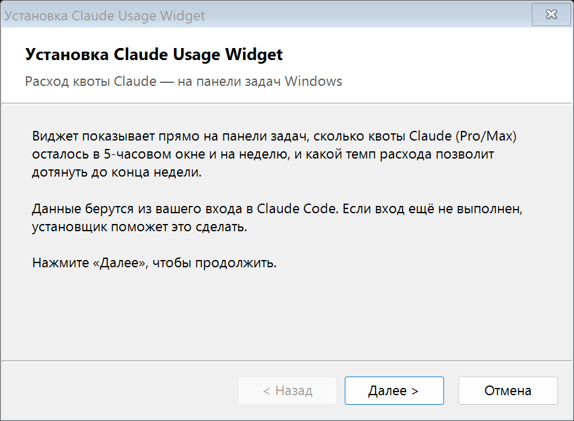
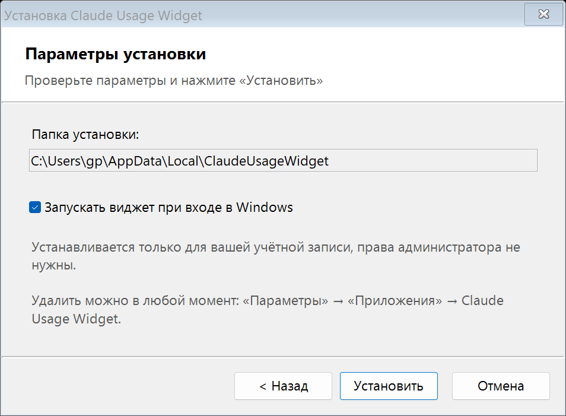

# Claude Usage Widget

**Русский** | [English](README.en.md)

Реальный расход квоты Claude (Max / Pro) — на панели задач Windows, с планом расходования.

**Сам виджет квоту не тратит:** он только читает статистику расхода и не отправляет ни одного запроса к моделям.

Панель usage на claude.ai говорит «On track», считая линейно до сброса. Этот проект считает иначе:
сколько можно тратить, чтобы выйти ровно в 100 % **к вечеру пятницы** (недельная квота) и **к концу
5-часового окна**, — и показывает результат прямо на панели задач.


Верхняя строка — 5-часовое окно, нижняя — неделя. Полоска тает по мере расхода и меняет цвет: зелёная — по плану,
жёлтая и красная — расход опережает план. Недельная полоска составная: широкая часть — общий лимит на все модели,
узкая справа — отдельный недельный лимит Fable (если он есть в тарифе).

> [!WARNING]
> **Неофициальный инструмент — используйте на свой риск.** Виджет не связан с Anthropic. Он читает токен входа
> Claude Code на вашем компьютере, обращается с ним к недокументированному адресу статистики и сам продлевает
> токен, когда тот истекает. Anthropic [предназначает вход по подписке](https://code.claude.com/docs/en/legal-and-compliance) только для Claude Code и своих
> приложений и ограничивает его использование сторонними программами. Исключения для чтения статистики в
> условиях нет, поэтому Anthropic может закрыть виджету доступ к данным или принять меры в отношении аккаунта.
> Токен не передаётся никуда, кроме серверов Anthropic; весь код открыт.

## Быстрая установка (Windows, для всех)

1. Скачайте **[ClaudeUsageWidget-Setup.exe](https://github.com/gp131313/claude-usage-widget/releases/latest/download/ClaudeUsageWidget-Setup.exe)**.
2. Запустите его и пройдите мастер: «Далее» → «Установить» → «Готово».

<p> </p>

Если вход в Claude Code ещё не выполнен, установщик предложит поставить Claude Code и войти в ваш аккаунт
Claude (Pro/Max).

Есть и тихий вариант — **[ClaudeUsageWidget-Setup-Silent.exe](https://github.com/gp131313/claude-usage-widget/releases/latest/download/ClaudeUsageWidget-Setup-Silent.exe)**:
запустил — и виджет появился, без единого окна (то же делает `ClaudeUsageWidget-Setup.exe /silent`; ключ `/dir=<папка>` задаёт папку установки). Шаг входа
в Claude он пропускает: если входа нет, виджет покажет «Войдите в Claude» — правый щелчок → «Войти в аккаунт Claude…».

Всё. Виджет появится на панели задач слева от значков у часов и будет запускаться сам. Сервер не нужен,
права администратора не нужны. Удаление — «Параметры» → «Приложения» или меню «Пуск» → «Удалить Claude Usage Widget».

Если Windows покажет «Система Windows защитила ваш компьютер» — «Подробнее» → «Выполнить в любом случае»
(установщик не подписан). Не хотите запускать exe — в том же релизе есть `ClaudeUsageWidget-Setup-*.zip`:
распакуйте и дважды щёлкните `Setup.cmd`, результат тот же. Антивирус может ругаться на `Add-Type` с вызовами WinAPI — это ложное срабатывание,
папку `%LOCALAPPDATA%\ClaudeUsageWidget` можно добавить в исключения.

## Как это работает

```
Claude Code (залогинен) --.credentials.json--> server/usage_server.py --HTTP JSON--> windows/ClaudeUsageWidget.ps1
      (любой Linux-хост)                         /usage.json  /raw.json                (виджет на панели задач)
```

Два режима:

- **Автономный** (по умолчанию, ставит `Setup.cmd`): виджет сам раз в 5 минут ходит в API Anthropic с токеном
  Claude Code из `%USERPROFILE%\.claude\.credentials.json` и сам считает план. Когда токен истекает, виджет
  продлевает его по refresh-токену (`platform.claude.com/v1/oauth/token`, как это делает сам Claude Code) и
  записывает обратно в тот же файл.
- **Клиент сервера**: если в `ClaudeUsageWidget.json` задан `url`, виджет берёт готовый расчёт с сервера:

1. **Сервер** (Python 3, только stdlib) раз в 5 минут дёргает тот же эндпоинт, что и `/usage` в Claude Code —
   `GET https://api.anthropic.com/api/oauth/usage` — OAuth-токеном Claude Code из `~/.claude/.credentials.json`.
   Считает план и отдаёт `http://<host>:8766/usage.json` в LAN.
2. **Виджет** (PowerShell 7 + WinForms) раз в минуту читает JSON и рисует две строки без фона прямо на панели
   задач, левее области уведомлений. Позиция и высота подстраиваются под панель автоматически.

Эндпоинт недокументирован; формат ответа может измениться. Сервер написан так, чтобы не падать на незнакомых полях.

## Логика плана

| Счётчик | План | Цвет |
|---|---|---|
| Неделя (общий лимит, все модели) | линейно от сброса (сб 07:00) до пт 22:00 (`plan_end_offset_hours: 9`) | зелёный <= +4 % к плану, жёлтый до +10 %, красный выше |
| 5-часовое окно | линейно от начала окна (`resets_at - 5 ч`) до сброса | зелёный <= +10 %, жёлтый до +25 % или >= 80 % потрачено, красный выше / >= 95 % |

Все проценты — **абсолютные проценты квоты** (0–100), не относительные. Пороги правятся в `server/config.json`,
применяются без перезапуска.

## Установка

### Сервер (Linux, где залогинен Claude Code)

```bash
git clone https://github.com/gp131313/claude-usage-widget.git
cd claude-usage-widget/server
cp config.example.json config.json      # при желании поправить пороги/часовой пояс
./install.sh                            # crontab: @reboot + сторож раз в 5 мин; запускает сервис
curl -s localhost:8766/usage.json | python3 -m json.tool
```

Root не нужен. Порт 8766 должен быть доступен с Windows-машины (LAN/VPN).

Токен Claude Code живёт ~8 часов и обновляется только когда Claude Code сам ходит в API. Если Claude Code
долго простаивает — сервер получит 401, в JSON появится `stale: true`, виджет станет серым. Сервер
**намеренно не делает refresh сам**, чтобы не сломать сессию Claude Code (refresh-токен ротируется).

### Виджет вручную (Windows 10/11, PowerShell 7; без него — Windows PowerShell 5.1)

1. Скопировать `windows/ClaudeUsageWidget.ps1` и `windows/ClaudeUsageWidget.vbs` в одну папку.
2. Первый запуск: `wscript.exe ClaudeUsageWidget.vbs`. Без настроек работает автономно (нужен вход в Claude Code).
   Для режима клиента сервера рядом появится `ClaudeUsageWidget.json` — прописать в нём
   `"url": "http://<host>:8766/usage.json"` и перезапустить.
3. Правой кнопкой по виджету -> **Автозапуск**.

Лаунчер `.vbs` сам находит PowerShell 7 (`pwsh.exe` в Program Files, алиас Store-версии или PATH) и лишь при его
отсутствии берёт Windows PowerShell 5.1. Запуск через `.vbs`, а не `pwsh -WindowStyle Hidden`: Windows Terminal, если он терминал по умолчанию,
этот флаг игнорирует и показывает окно консоли; флаг скрытого окна через `WScript.Shell.Run(..., 0)` он уважает.

### Меню виджета (правая кнопка)

- **На панели задач (авто-позиция)**: сам встаёт левее трея, высота = высоте панели. Перетаскивание мышью
  выключает авто-режим.
- **Текст по правому краю**.
- **Сводка** (вверху меню и в подсказке при наведении): 5-часовое окно, неделя и отдельный лимит Fable;
  для недельных лимитов — ровный темп на остаток недели (% в день, с округлением до 10 %).
- **Войти в аккаунт Claude…** (автономный режим): открывает Claude Code для входа.
- **Автозапуск** (HKCU\...\Run).

## Технические заметки

- **Язык**: русский или английский — по языку Windows; принудительно — ключ `"lang": "ru"` или `"lang": "en"`
  в `ClaudeUsageWidget.json`.
- **DPI**: процесс объявляет per-monitor DPI awareness v2, все размеры в логических px x DPI. Без этого на
  масштабе > 100 % Windows растягивает окно битмапом — мыло.
- **Прозрачность**: `TransparencyKey`. Побочный эффект — на окнах с цветовым ключом ClearType даёт цветную
  бахрому, поэтому текст сглаживается в градациях серого (GDI+ `AntiAliasGridFit`).
- **Z-order**: панель задач тоже topmost и после каждого своего обновления всплывает выше. Сторож раз в секунду
  проверяет `WindowFromPoint` на непрозрачном пикселе виджета и при необходимости возвращает окно поверх.
  Пока открыт «Пуск» / центр уведомлений — виджет остаётся под панелью, это намеренно.
- **Полноэкранные окна**: пока активное окно (RDP-клиент, SmartPSS, видео, игра) занимает весь монитор виджета,
  виджет прячется, чтобы не висеть поверх; возвращается сам. Рабочий стол и развёрнутые окна за полноэкранные не считаются.
- **Антивирус**: `Add-Type` с P/Invoke (`ShowWindow`, `SetWindowPos`, `FindWindow`) — классический ложный
  «агент» для эвристик. Виджет уводит `TEMP` в подпапку `tmp` рядом со скриптом; папку со скриптами стоит
  добавить в исключения.

## Структура

```
server/
  usage_server.py        опрос API, расчёт плана, HTTP-раздача (stdlib)
  config.example.json    пороги, часовой пояс, конец плана
  watchdog.sh            запуск/перезапуск сервиса (для cron)
  install.sh             crontab @reboot + */5, запуск
windows/
  Setup.cmd              установщик из архива (запускает install.ps1)
  install.ps1            копирование в %LOCALAPPDATA%, Claude Code + вход, автозапуск, ярлыки
  uninstall.ps1          удаление (Claude Code не трогает)
  ClaudeUsageWidget.ps1  виджет на панели задач
  ClaudeUsageWidget.vbs  лаунчер со скрытой консолью
  ClaudeUsageTray.ps1    старый вариант: три значка в трее (5ч %, время сброса, неделя)
  setup/Setup.cs         установщик одним файлом: мастер и тихий вариант (те же файлы внутри exe)
  setup/build.ps1        его сборка компилятором C# из состава Windows, без SDK
docs/                    скриншоты для README
```

## Ограничения

- Только подписочные аккаунты (OAuth Claude Code). Для API-ключей эндпоинт ничего не отдаёт.
- Эндпоинты usage и продления токена недокументированы; Anthropic может их изменить.
- Автономный режим продлевает токен сам. Если в этот момент на том же ПК работает Claude Code, возможна гонка
  за refresh-токен (он одноразовый): в худшем случае Claude Code попросит войти заново. Виджет продлевает токен
  только когда тот уже истёк, чтобы свести это к минимуму.
- Панель задач Windows 11 не принимает сторонние deskband-панели, поэтому виджет — отдельное topmost-окно
  без рамки, а не часть панели.
- Мини-приложения (Win+W) требуют MSIX-пакета с `IWidgetProvider` — не стоит усилий.

## Поддержать

Если виджет оказался полезен — можно кинуть на кофе:

- **Dogecoin**: `D7z9UaBsmcV7EqJo5Y5fdLG9xUNw47dNgr`

## Лицензия

MIT.
